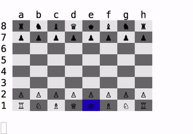

#Chess

Built a functional chess game with correct game logic.
Currently, working on building a computer AI.

`ruby lib/game.rb`

###Computer AI notes
- Current AI uses BoardTreeNodes to make a #best_move decision
- Analyzes tree to its grandchildren nodes only
- AI plays defense well, but cannot make smart offensive moves
- Completed one full game against AI to checkmate with no failures
- Need to build strategy for the beginning of the game

###Game notes
- need to fix pawn promote bug
- create Gemfile
